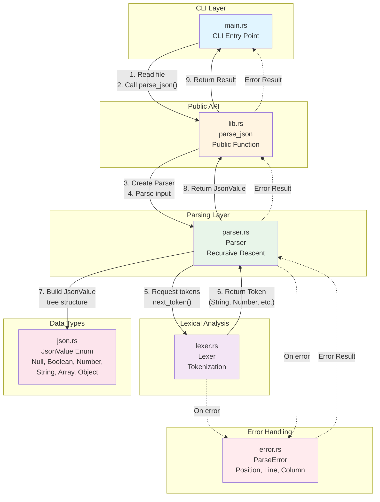
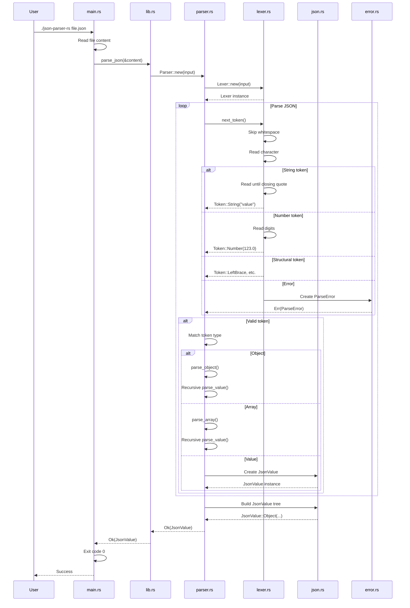
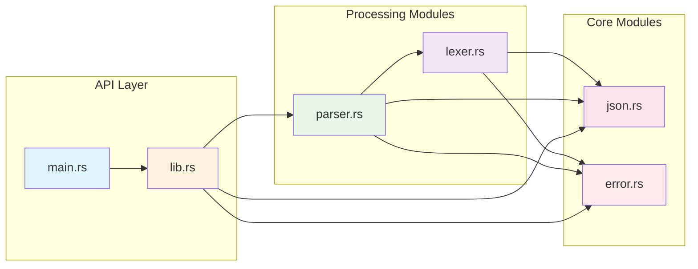

# JSON Parser - Architektur-Diagramm

## Komponenten-Interaktion



## Detaillierter Datenfluss



## Token-Flow Beispiel

```
Input: {"key": "value"}

┌─────────────────────────────────────────────────────────┐
│ Lexer: Character-by-character processing                │
└─────────────────────────────────────────────────────────┘
         │
         ▼
    '{' → Token::LeftBrace
    '"' → Token::String("key")
    ':' → Token::Colon
    '"' → Token::String("value")
    '}' → Token::RightBrace
    EOF → Token::Eof

┌─────────────────────────────────────────────────────────┐
│ Parser: Token-by-token processing                       │
└─────────────────────────────────────────────────────────┘
         │
         ▼
    LeftBrace → Start parse_object()
    String("key") → Key
    Colon → Expect colon
    String("value") → Value → JsonValue::String("value")
    RightBrace → End parse_object()
    
┌─────────────────────────────────────────────────────────┐
│ Result: JsonValue tree                                  │
└─────────────────────────────────────────────────────────┘
         │
         ▼
    JsonValue::Object(
        vec![
            ("key".to_string(), JsonValue::String("value".to_string()))
        ]
    )
```

## Modul-Abhängigkeiten



## ASCII-Diagramm (Text-basiert)

```
┌─────────────────────────────────────────────────────────────┐
│                        USER INPUT                            │
│                    {"key": "value"}                         │
└───────────────────────┬─────────────────────────────────────┘
                        │
                        ▼
┌─────────────────────────────────────────────────────────────┐
│  main.rs                                                     │
│  ┌───────────────────────────────────────────────────────┐ │
│  │ 1. Read file content                                    │ │
│  │ 2. Call parse_json(&content)                           │ │
│  └───────────────────────┬─────────────────────────────────┘ │
└──────────────────────────┼───────────────────────────────────┘
                           │
                           ▼
┌─────────────────────────────────────────────────────────────┐
│  lib.rs                                                      │
│  ┌───────────────────────────────────────────────────────┐ │
│  │ parse_json(input: &str)                                │ │
│  │   → Parser::new(input)?                                │ │
│  │   → parser.parse()                                     │ │
│  └───────────────────────┬─────────────────────────────────┘ │
└──────────────────────────┼───────────────────────────────────┘
                           │
                           ▼
┌─────────────────────────────────────────────────────────────┐
│  parser.rs                                                   │
│  ┌───────────────────────────────────────────────────────┐ │
│  │ Parser::new()                                         │ │
│  │   → Creates Lexer                                     │ │
│  │   → Reads first token                                 │ │
│  │                                                       │ │
│  │ parse()                                               │ │
│  │   → parse_value()                                     │ │
│  │     → parse_object() / parse_array()                 │ │
│  │       → Recursively calls parse_value()              │ │
│  └───────────────────────┬─────────────────────────────────┘ │
└──────────────────────────┼───────────────────────────────────┘
                           │
                           │ Requests tokens
                           ▼
┌─────────────────────────────────────────────────────────────┐
│  lexer.rs                                                    │
│  ┌───────────────────────────────────────────────────────┐ │
│  │ Lexer::new(input)                                     │ │
│  │   → Initialize position tracking                      │ │
│  │                                                       │ │
│  │ next_token()                                          │ │
│  │   → Skip whitespace                                   │ │
│  │   → Match character:                                 │ │
│  │     • '{' → Token::LeftBrace                        │ │
│  │     • '"' → read_string() → Token::String            │ │
│  │     • '0'-'9' → read_number() → Token::Number        │ │
│  │     • 't'/'f'/'n' → read_keyword() → Token::Boolean │ │
│  │   → Return Token or ParseError                       │ │
│  └───────────────────────┬─────────────────────────────────┘ │
└──────────────────────────┼───────────────────────────────────┘
                           │
                           │ Returns Token
                           ▼
┌─────────────────────────────────────────────────────────────┐
│  parser.rs (continued)                                        │
│  ┌───────────────────────────────────────────────────────┐ │
│  │ Builds JsonValue tree from tokens:                    │ │
│  │   Token::String → JsonValue::String                   │ │
│  │   Token::Number → JsonValue::Number                   │ │
│  │   Token::Boolean → JsonValue::Boolean                 │ │
│  │   Token::Null → JsonValue::Null                       │ │
│  │   Object tokens → JsonValue::Object(Vec<...>)         │ │
│  │   Array tokens → JsonValue::Array(Vec<...>)          │ │
│  └───────────────────────┬─────────────────────────────────┘ │
└──────────────────────────┼───────────────────────────────────┘
                           │
                           ▼
┌─────────────────────────────────────────────────────────────┐
│  json.rs                                                     │
│  ┌───────────────────────────────────────────────────────┐ │
│  │ JsonValue Enum:                                        │ │
│  │   • Null                                              │ │
│  │   • Boolean(bool)                                     │ │
│  │   • Number(f64)                                       │ │
│  │   • String(String)                                    │ │
│  │   • Array(Vec<JsonValue>)                             │ │
│  │   • Object(Vec<(String, JsonValue)>)                  │ │
│  └───────────────────────────────────────────────────────┘ │
└──────────────────────────┬───────────────────────────────────┘
                           │
                           │ Returns Result<JsonValue, ParseError>
                           ▼
┌─────────────────────────────────────────────────────────────┐
│  error.rs (used throughout)                                  │
│  ┌───────────────────────────────────────────────────────┐ │
│  │ ParseError {                                           │ │
│  │   message: String,                                     │ │
│  │   position: usize,                                     │ │
│  │   line: usize,                                         │ │
│  │   column: usize,                                       │ │
│  │ }                                                      │ │
│  └───────────────────────────────────────────────────────┘ │
└─────────────────────────────────────────────────────────────┘
                           │
                           ▼
┌─────────────────────────────────────────────────────────────┐
│  main.rs                                                     │
│  ┌───────────────────────────────────────────────────────┐ │
│  │ Match result:                                          │ │
│  │   Ok(value) → Exit 0 (success)                        │ │
│  │   Err(e) → Print error → Exit 1 (error)              │ │
│  └───────────────────────────────────────────────────────┘ │
└─────────────────────────────────────────────────────────────┘
```

## Wichtige Konzepte

### 1. **Datenfluss (Data Flow)**
- **Top-Down**: main.rs → lib.rs → parser.rs → lexer.rs
- **Bottom-Up**: lexer.rs (Tokens) → parser.rs (JsonValue) → lib.rs (Result) → main.rs

### 2. **Error Propagation**
- Fehler können in jedem Modul entstehen
- Werden als `Result<T, ParseError>` nach oben propagiert
- `?` Operator für automatische Propagation

### 3. **Rekursive Struktur**
- `parse_value()` ruft sich selbst auf für verschachtelte Objekte/Arrays
- Spiegelt die rekursive Natur von JSON wider

### 4. **Lazy Evaluation**
- Lexer liest nur einen Token zur Zeit
- Parser verarbeitet Token für Token
- Keine vollständige Token-Liste im Speicher

### 5. **Type Safety**
- Alle JSON-Werte sind `JsonValue` Enum
- Compiler prüft Vollständigkeit bei Pattern Matching
- Keine Runtime-Type-Checks nötig
